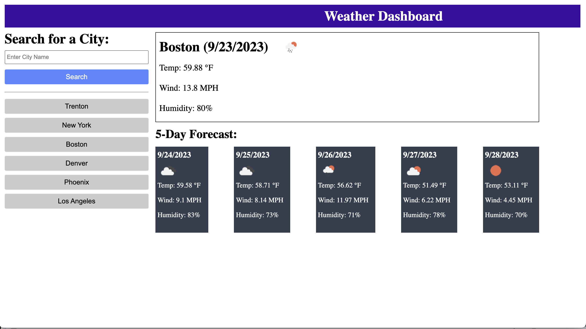

# Weather App

## Description

In this assignment we were task with creating a weather app that allows you to search by city.  Not only does it display the current weather info it will also display the 5 day forecast.

## Repository

Link to deployed code:  https://jarrodkrauszer.github.io/weather_app/

## Technologies

 - We used HTML and CSS to structure and style the static parts of our web app
 - We used Javascript to handle all the dynamic parts of our app as well as backend programming
 - In css we used flexbox to align and justify all the content on the page.

## Mock-Up

The following image shows the web application's appearance and functionality:

